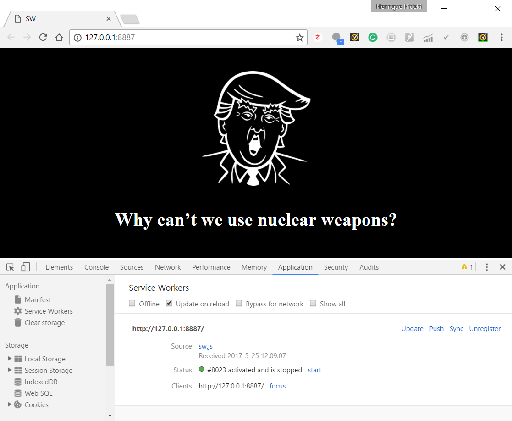

# _Service Workers API_

Exemplo de uso de _service workers_ do HTML5.

## Links do Exemplo

- Link para seminário: [slides de aula][slides]
- Link para exemplo publicado: [página no GitHub][demo]

## Créditos

Este trabalho foi realizado em 2017/01 para a disciplina de Programação para Web do CEFET-MG no Campus II de Belo Horizonte.

Autor(es):

1. Henrique Hideki (201322040150)
2. Saulo Antunes Silva (201422040305)

Atribuições:

- What Does Trump Think API[trump-api]

[slides]: https://docs.google.com/presentation/d/1YBGf4-iLie3rTKR0Qk6wiZ3aoEg8TilgWSd4KzWNRK4/edit?usp=sharing
[demo]: https://fegemo.github.io/cefet-web-weblot/apis/service-workers/
[trump-api]: https://whatdoestrumpthink.com/api-docs/index.html